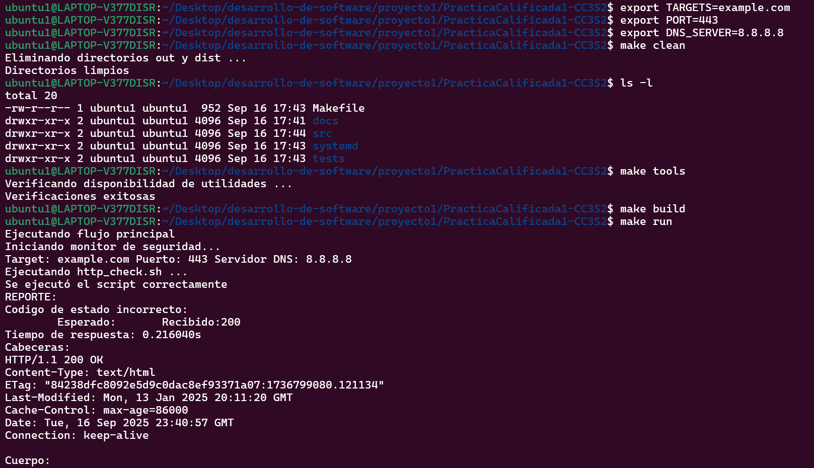

# Bitácora Sprint 1

## Objetivo del sprint
- Base de codigo(12-factor-app): Creación del repositorio y la estructura de archivos.
- Configuración por variables de entorno(12-factor-app): Se definen las variables de entorno en un archivo ignorado por git.
- Primeros checkeos HTTP/DNS: Uso de curl y dig en los scripts, las evidencias se guardan en /out.
- Makefile inicial(targets básicos): build, run, clean,test. Etiquetas básicas.

## Comandos ejecutados (con explicación)
Para iniciar el repositorio se usa: `git init`, para agregar cambios y archivos al repositorio: `git add`, para registrar un conjunto de cambios: `git commit`, para subir los commits al repositorio remoto: `git push`.
- dns_check.sh (hace la consulta al servidor dns con dig y guarda la salida en un archivo)
```bash
#!/usr/bin/env bash

DIRECTORIO_RAIZ="$(dirname "$(dirname "$(realpath "$0")")")" #realpath "$0", devuelve la ruta absoluta del script($0)
DIRECTORIO_SALIDA="${DIRECTORIO_RAIZ}/out/dns"
mkdir -p "${DIRECTORIO_SALIDA}" # mkdir sirve para crear directorios, el parametro -p sirve para crear directorios intermedios si no existen

#Consulta el dominio al servidor dns definido
dig "@${DNS_SERVER}" "${TARGETS}" > "${DIRECTORIO_SALIDA}/salida_dig.txt"
```
- http_check.sh ( hace la consulta del contrato HTTP con curl, guarda cabecera y cuerpo en archivos)
```bash
#!/usr/bin/env bash

DIRECTORIO_RAIZ="$(dirname "$(dirname "$(realpath "$0")")")"
DIRECTORIO_SALIDA="${DIRECTORIO_RAIZ}/out/http"
mkdir -p "${DIRECTORIO_SALIDA}"

#Verificar codigo de estado
codigo_de_estado="$(curl -s -o /dev/null -w "%{http_code}" "${TARGETS}")"
if [ "${CODIGO_DE_ESTADO_ESPERADO}" == "${codigo_de_estado}" ]; then
    echo -e "Codigo de estado correcto: ${codigo_de_estado}\n" > "${DIRECTORIO_SALIDA}/reporte_http.txt"
else
    echo -e "Codigo de estado incorrecto:\n\tEsperado:${CODIGO_DE_ESTADO_ESPERADO}\tRecibido:${codigo_de_estado}" > "${DIRECTORIO_SALIDA}/reporte_http.txt"
fi
#Incluye el tiempo de respuesta en el reporte y envía el cuerpo a out/cuerpo_http.txt
curl -s -o "${DIRECTORIO_SALIDA}/cuerpo_http.txt" -w "Tiempo de respuesta: %{time_total}s\n" "${TARGETS}" >> "${DIRECTORIO_SALIDA}/reporte_http.txt"
#-s oculta la información de progreso, -o sirve para redirigir el cuerpo, I sirve para consultar las cabeceras
curl -sI "${TARGETS}" > "${DIRECTORIO_SALIDA}/cabeceras.txt" #Crea archivo con las cabeceras
```
- monitor.sh (ejecuta http_check.sh y dns_check.sh y muestra por stdout los archivos creados)
```bash
#!/usr/bin/env bash

DIRECTORIO_RAIZ="$(dirname "$(dirname "$(realpath "$0")")")"

echo "Iniciando monitor de seguridad..."
echo "Target: ${TARGETS} Puerto: ${PORT} Servidor DNS: ${DNS_SERVER}"
#HTTP
echo "Ejecutando http_check.sh ..."
if bash ${DIRECTORIO_RAIZ}/src/http_check.sh; then
    echo "Se ejecutó el script correctamente"
else
    echo "Error al ejecutar el script"
    exit 1
fi
echo "REPORTE:"
cat "${DIRECTORIO_RAIZ}/out/http/reporte_http.txt" #Muestra el archivo
sleep 2 # Detiene el flujo del programa por 2 segundos
echo "Cabeceras:"
cat "${DIRECTORIO_RAIZ}/out/http/cabeceras.txt"
sleep 2
echo "Cuerpo:"
cat "${DIRECTORIO_RAIZ}/out/http/cuerpo_http.txt"
#DNS
echo "Ejecutando dns_check.sh ..."
if bash ${DIRECTORIO_RAIZ}/src/dns_check.sh; then
    echo "Se ejecutó el script correctamente"
else
    echo "Error al ejecutar el script"
    exit 1
fi
echo "REPORTE:"
sleep 2
cat "${DIRECTORIO_RAIZ}/out/dns/salida_dig.txt"
```
Para las pruebas básicas se creó un archivo test_helpers.bash, para guardar funciones que se van a usar en las pruebas. Y se crearon los archivos de prueba para los scripts http_tests.bats dns_tests.bats, probando ejecución correcta y creación de archivos.
```bash
#!/usr/bin/env bats

DIRECTORIO_RAIZ="$(cd "$BATS_TEST_DIRNAME/.." && pwd)"
load ${DIRECTORIO_RAIZ}/tests/test_helpers.bash # Carga las funciones setup() y teardown() se ejecutan al inicio y al final de cada prueba respectivamente
@test "Comprobando ejecucion correcta del script y creacion de archivos" {
    bash ${DIRECTORIO_RAIZ}/src/dns_check.sh # Ejecuta el script
    [ -f "${DIRECTORIO_RAIZ}/out/dns/salida_dig.txt" ] # Comprueba la existencia del archivo creado
}
```
En el makefile se definieron variables como SHELL, directorios, y las etiquetas básicas: tools, build, run, clean y test
## Evidencias (salidas recortadas y comentadas)
Probando el programa usando make

```
# exportar variables de entorno
make tools
make build
make run
# automatizado
make all
```
