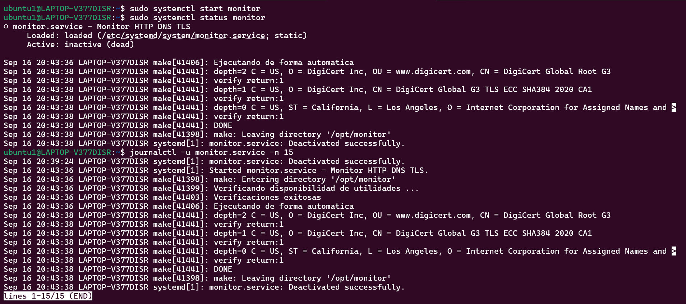

# Bitácora Sprint 2

## Objetivo del sprint
- Bash robusto( uso de trap, set -euo pipefail y manejo de errores), uso de pipelines con Unix toolkit.
- Systemd, unidad de servicio mínima.
- Ampliar bats, matriz mínima de casos.

## Comandos ejecutados (con explicación)
`set -euo pipefail` sirve para que el programa se detenga al producirse algún error, considera errores a las variables no definidas y propaga los errores en los pipelines.
`trap` sirve para recibir señales. Permite realizar instrucciones antes de finalizar el programa, por ejemplo si el programa falla en el momento que está creando los archivos, trap recibe la señal del error y puede ejecutar una función para limpiar los directorios de salida, y mostra un código de estado específico.
`grep` sirve para filtrar y buscar patrones dentro de un texto. Se usó para buscar información y lineas relevantes en los archivos de salida.
`sed` sirve para modificar el texto usando patrones, se usó para dar formato a los archivos de salida.
`awk` sirve para procesar y filtrar texto. Se usó para extraer fragmentos específicos de los archivos de salida.
`tail` sirve para extraer la últimas lineas de un texto.
`read` sirve para leer una entrada usario y almacenarla en una variable.
`clear` limpia la pantalla de la terminal.

## Evidencias (salidas recortadas y comentadas)
Se agregó interactividad para mostrar las salidas.

Se ampliaron las pruebas.

Se creó una unidad en systemd para gestionar el programa como servicio.

